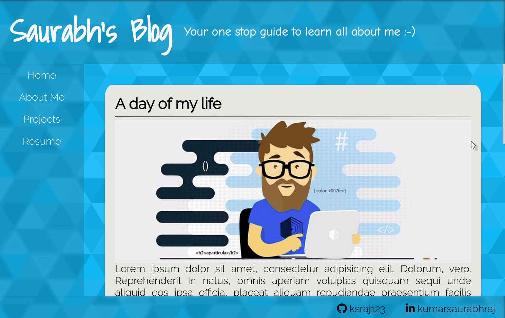

# Personal Blog Website

This repository contains my under developerment website which will incorporate my entire online technical presecnse like my projects, open source contributions, resume and technical blog posts into a single platform.

### Installing

The current build is a static website and comprises for basic html.
```
Can be started by opening
homepage.html
with any modern browser
```
Internet connectivity might be required for loading some fonts and icons from CDNs.

## Demo Preview


## Built With

* HTML
* CSS

## License

This project is licensed under the MIT License - see the [LICENSE.md](LICENSE.md) file for details
